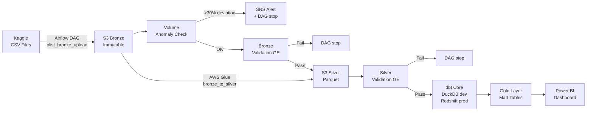
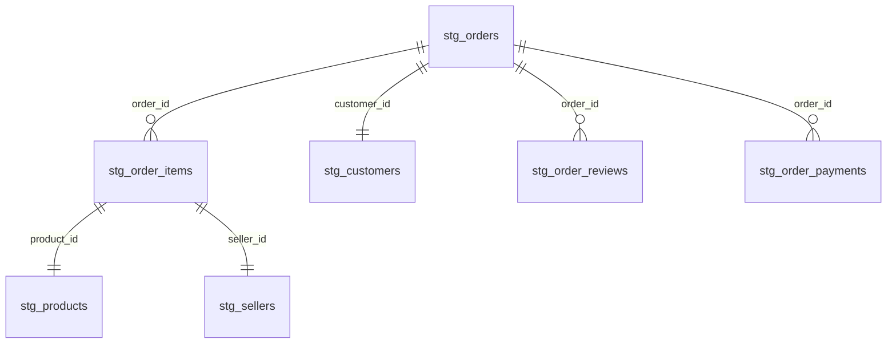

# Olist E-Commerce Analytics Pipeline

End-to-end ELT pipeline on the [Olist Brazilian E-Commerce Dataset](https://www.kaggle.com/datasets/olistbr/brazilian-ecommerce) — built as a portfolio project following industry DataOps standards.


---

## What this project does

Transforms 9 raw CSV files from the Olist Brazilian marketplace (~100k orders, 2016–2018) into a Power BI dashboard answering 4 business questions — fully automated, tested, and deployed on AWS.

**Business Questions answered:**

| # | Question | KPI |
|---|----------|-----|
| BQ-01 | Which product categories generate the most revenue? | Revenue per category |
| BQ-02 | Which regions perform best? | Revenue per state |
| BQ-03 | How long does delivery take — where are the delays? | Avg. delivery days, late delivery rate |
| BQ-04 | How satisfied are customers and what drives reviews? | Avg. review score, delay/rating correlation |

---

## Architecture



**Medallion Architecture on AWS S3:**

```
Bronze  →  Raw CSV (immutable, append-only)
Silver  →  Cleaned Parquet (Glue transformation)
Gold    →  Aggregated marts (dbt models)
```

---

## Tech Stack

| Layer | Technology |
|-------|-----------|
| Orchestration | Apache Airflow 2.x (Docker) |
| Ingestion | Python + boto3 |
| Bronze → Silver | AWS Glue (Python Shell) |
| Silver → Gold | dbt Core — DuckDB (dev) / Redshift Serverless (prod) |
| Data Warehouse | AWS Redshift Serverless |
| Storage | AWS S3 — Bronze / Silver / Gold |
| Data Quality | Great Expectations + dbt Tests (49/49 PASS) |
| IaC | Terraform >= 1.5 (Remote State: S3 + DynamoDB) |
| Secrets | AWS Secrets Manager (boto3) |
| CI/CD | GitHub Actions (`ci.yml`) |
| Monitoring | AWS CloudWatch + SNS Alerting |
| Visualization | Power BI Desktop (ODBC → Redshift) |
| Language | Python 3.11, SQL |

---

## Pipeline Flow

```
1. upload_bronze       — 9 CSV files parallel → S3 Bronze
2. check_volume_anomaly — Row count vs. baseline (threshold 70%) → SNS alert on anomaly
3. validate_bronze     — Great Expectations: PK not-null/unique, row count per table
4. start_glue_job      — AWS Glue: Bronze CSV → Silver Parquet
5. wait_for_silver     — S3KeySensor: waits until Silver Parquet appears
6. trigger_silver_to_gold — dbt run + dbt test on DuckDB/Redshift (49 tests)
```

---

## dbt Models (17 total, 49 tests — all PASS)

| Layer | Models | Materialization |
|-------|--------|----------------|
| Staging (`stg_`) | 8 | view |
| Intermediate (`int_`) | 2 | ephemeral |
| Marts (`fct_` / `dim_` / `kpi_`) | 7 | table |

Tests per model: `not_null` + `unique` on PKs, `relationships` on FKs.

---

## Data Model



---

## Screenshots

> Power BI Dashboard — 4 pages, 6 KPIs

<!-- Replace placeholders with actual screenshots -->
| Page | Preview |
|------|---------|
| BQ-01 Revenue by Category | *(screenshot)* |
| BQ-02 Revenue by Region | *(screenshot)* |
| BQ-03 Delivery Performance | *(screenshot)* |
| BQ-04 Customer Satisfaction | *(screenshot)* |

---

## Project Structure

```
ecomm_pipeline/
├── .github/
│   └── workflows/
│       ├── ci.yml                          # dbt run + dbt test on push/PR to main
│       └── dbt_pipeline.yml                # Full pipeline run
├── airflow/
│   └── dags/
│       ├── olist_bronze_upload.py          # CSV → S3 + validation + Glue trigger
│       └── olist_silver_to_gold.py         # dbt run + dbt test (Redshift)
├── ci/
│   └── run_dbt_ci.sh                       # Local CI check script
├── glue/
│   └── jobs/
│       └── bronze_to_silver.py             # S3 Bronze CSV → S3 Silver Parquet
├── dbt/
│   ├── models/
│   │   ├── staging/                        # 8x stg_* models
│   │   ├── intermediate/                   # int_orders_enriched, int_delivery_times
│   │   └── marts/                          # fct_sales, fct_regional_performance,
│   │                                       # fct_delivery, fct_reviews, dim_*, kpi_*
│   └── profiles.yml                        # DuckDB (dev) + Redshift (prod)
├── great_expectations/
│   ├── validate_bronze.py                  # Bronze CSV validation (9 tables)
│   └── validate_silver.py                  # Silver Parquet validation (5 tables)
├── terraform/
│   └── modules/                            # S3, IAM, Glue, Redshift, Monitoring
├── notebooks/
│   └── 01_eda.ipynb                        # Exploratory Data Analysis
└── RUNBOOK.md                              # Incident response procedures
```

---

## Local Setup

### Prerequisites

- Python 3.11
- Docker Desktop (for Airflow)
- AWS account with S3, Glue, IAM, Redshift configured
- Terraform >= 1.5

### 1 — Clone and create virtual environment

```bash
git clone https://github.com/Omexes/ecomm_pipeline.git
cd ecomm_pipeline

python -m venv .venv
.venv\Scripts\activate        # Windows
# source .venv/bin/activate   # Linux/Mac

pip install dbt-core dbt-duckdb great-expectations boto3 pandas pyarrow
```

### 2 — Configure AWS credentials

```bash
cp .env.example .env
# Fill in AWS_ACCESS_KEY_ID, AWS_SECRET_ACCESS_KEY, AWS_DEFAULT_REGION, S3_BUCKET
```

Load credentials in PowerShell:

```powershell
Get-Content .env | Where-Object { $_ -match '=' -and $_ -notmatch '^#' } |
  ForEach-Object { $p = $_ -split '=', 2; [System.Environment]::SetEnvironmentVariable($p[0], $p[1]) }
```

### 3 — Run dbt locally (DuckDB dev target)

```bash
cd dbt
dbt deps                          # Install packages
dbt run --target dev              # Build all 17 models
dbt test --target dev             # Run all 49 tests
dbt docs generate && dbt docs serve   # Browse documentation
```

### 4 — GitHub Actions CI — required secrets

In your GitHub repository under **Settings → Secrets → Actions**, add:

| Secret | Value |
|--------|-------|
| `AWS_ACCESS_KEY_ID` | Your AWS access key |
| `AWS_SECRET_ACCESS_KEY` | Your AWS secret key |
| `AWS_DEFAULT_REGION` | `eu-central-1` |

The `ci.yml` workflow runs `dbt run + dbt test` on every push and PR to `main`.

---

## Infrastructure (Terraform)

All AWS resources are defined as code. No manual console steps.

```bash
cd terraform
terraform init
terraform plan    # Review changes
terraform apply   # Confirm with 'yes'
```

Resources managed: S3 buckets (Bronze/Silver/Gold + CRR), IAM roles (Glue + Airflow), AWS Glue job, Redshift Serverless workgroup, Secrets Manager, CloudWatch alarms + SNS.

---

## Monitoring & Recovery

| Scenario | Recovery |
|----------|----------|
| Volume anomaly detected | SNS email alert — check source data, re-upload CSVs |
| Bronze GE validation fails | Fix source data — Bronze is immutable, re-upload safely |
| Glue job fails | Re-trigger DAG from `start_glue_job` in Airflow UI |
| dbt test fails | Check `dbt/target/run_results.json`, fix upstream, `dbt run --select <model>` |
| S3 data corrupted | S3 Versioning enabled — restore previous version via CLI |

CloudWatch alarm fires within 5 minutes of Glue failure → SNS email notification.

---

## Dataset

[Olist Brazilian E-Commerce Dataset](https://www.kaggle.com/datasets/olistbr/brazilian-ecommerce) — Kaggle, CC BY-NC-SA 4.0

~100,000 orders from 2016–2018 across multiple Brazilian marketplaces. 9 source tables.
