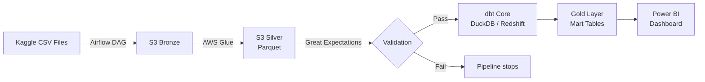
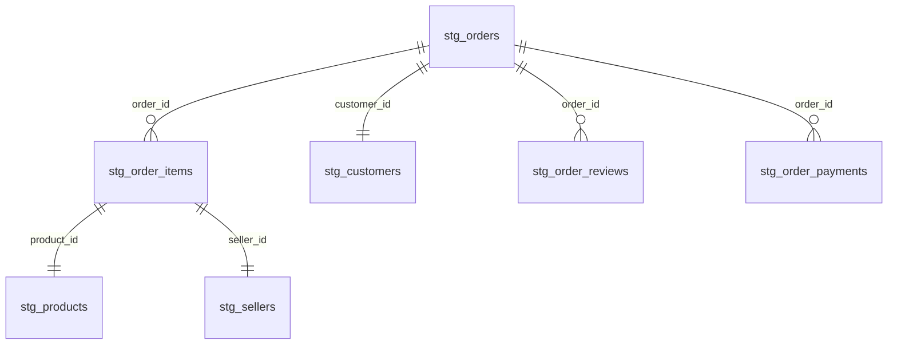

# Olist E-Commerce Analytics Pipeline

End-to-end ELT pipeline on the [Olist Brazilian E-Commerce Dataset](https://www.kaggle.com/datasets/olistbr/brazilian-ecommerce) built as a portfolio project following industry standards and DataOps best practices.

## Architecture



## Tech Stack

| Layer | Technology |
|-------|-----------|
| Orchestration | Apache Airflow 2.x (Docker local, Amazon MWAA prod) |
| Ingestion | Python + boto3 |
| Transformation Bronze to Silver | AWS Glue (Python Shell) |
| Transformation Silver to Gold | dbt Core + DuckDB (local) / Redshift (prod) |
| Data Warehouse | AWS Redshift Serverless |
| Storage | AWS S3 - Medallion Architecture (Bronze / Silver / Gold) |
| Data Quality | Great Expectations + dbt Tests |
| IaC | Terraform >= 1.5 |
| CI/CD | GitHub Actions |
| Visualization | Power BI Desktop |
| Language | Python 3.11, SQL |

## Business Questions & KPIs

| # | Question | KPI |
|---|----------|-----|
| BQ-01 | Which product categories generate the most revenue? | Revenue per category |
| BQ-02 | Which regions perform best? | Revenue per state |
| BQ-03 | How long does delivery take - where are the delays? | Avg. delivery days, late rate % |
| BQ-04 | How satisfied are customers and what influences reviews? | Avg. review score, correlation delay/rating |

## Project Structure

```
ecomm_pipeline/
├── airflow/
│   └── dags/
│       └── olist_bronze_upload.py      # CSV → S3 Bronze
├── glue/
│   └── jobs/
│       └── bronze_to_silver.py         # S3 Bronze → S3 Silver (Parquet)
├── dbt/
│   └── models/
│       ├── staging/                    # 8x stg_* models
│       ├── intermediate/               # int_orders_enriched, int_delivery_times
│       └── marts/                      # fct_sales, fct_regional_performance,
│                                       # fct_delivery, fct_reviews
├── great_expectations/
│   └── validate_silver.py              # Silver layer validation (42 checks)
├── terraform/                          # IaC: S3, IAM, Glue, Redshift
├── scripts/
│   └── export_to_csv.py                # Gold export for Power BI
├── notebooks/
│   └── 01_eda.ipynb                    # Exploratory Data Analysis
└── run_pipeline.py                     # Pipeline runner: GE → dbt run → dbt test
```

## Pipeline Phases

### Phase 1 - EDA
Exploratory analysis of all 9 source tables. Key findings: 1.85% null category names (filled with `unknown`), duplicate `review_id` entries (deduplicated in staging via `ROW_NUMBER()`).

### Phase 2 - Bronze Layer
Airflow DAG uploads raw CSV files to S3 Bronze (immutable). AWS Glue job cleans and converts to Parquet in S3 Silver.

### Phase 3 - Silver to Gold (dbt)
14 dbt models across 3 layers: 8 staging, 2 intermediate, 4 marts. All 42 dbt tests pass (not_null, unique, relationships).

### Phase 4 - Data Quality & CI/CD
Great Expectations validates Silver data before dbt runs (5 tables, 42 checks). GitHub Actions automatically runs the full pipeline on every push to main.

### Phase 5 - Power BI Dashboard
4-page dashboard answering all business questions. Data exported from DuckDB Gold layer as CSV.

## Running Locally

### Prerequisites

- Python 3.11
- Docker Desktop (for Airflow)
- AWS account with S3, Glue, IAM configured

### Setup

```bash
# Clone the repository
git clone https://github.com/Omexes/ecomm_pipeline.git
cd ecomm_pipeline

# Create virtual environment
python -m venv .venv
.venv\Scripts\activate  # Windows

# Install dependencies
pip install dbt-duckdb great-expectations boto3 pandas pyarrow

# Configure environment variables
cp .env.example .env
# Fill in your AWS credentials in .env
```

### Run the pipeline

```bash
# Load environment variables (PowerShell)
Get-Content .env | Where-Object { $_ -match '=' -and $_ -notmatch '^#' } | ForEach-Object { $parts = $_ -split '=', 2; [System.Environment]::SetEnvironmentVariable($parts[0], $parts[1]) }

# Run full pipeline: GE validation + dbt run + dbt test
python run_pipeline.py

# Export Gold tables for Power BI
python scripts/export_to_csv.py
```

### dbt commands

```bash
cd dbt
dbt run              # Build all models
dbt test             # Run all 42 tests
dbt docs generate    # Generate documentation
dbt docs serve       # Open documentation in browser
```

## Data Model



## Dataset

[Olist Brazilian E-Commerce Dataset](https://www.kaggle.com/datasets/olistbr/brazilian-ecommerce) - Kaggle, CC BY-NC-SA 4.0

~100,000 orders from 2016 to 2018 across multiple Brazilian marketplaces.
